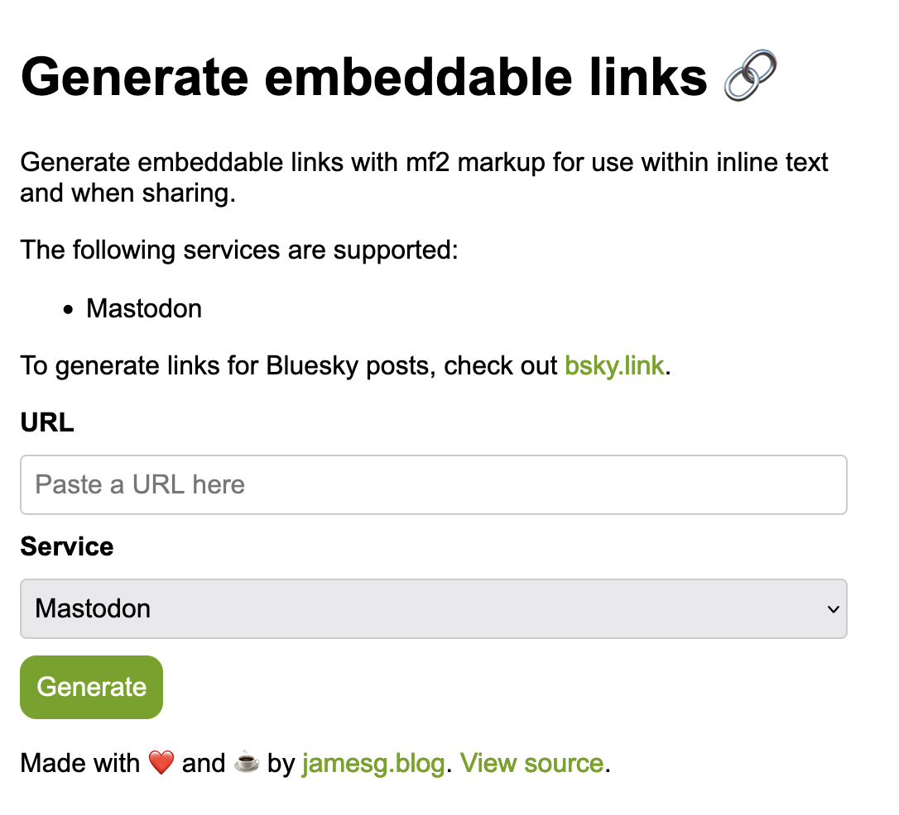

# mf2.link

Generate embeddable links with mf2 markup for use within inline text and when sharing. 

## Screenshot



## Installation

To run the application, first install the required dependencies:

```
npm install
```

Then, open `config.js` and add your Bluesky handle and password.

Finally, run the following command to start the application server:

```
npm start
```

## License

This project is licensed under an [MIT license](LICENSE).

## Contributors

- capjamesg